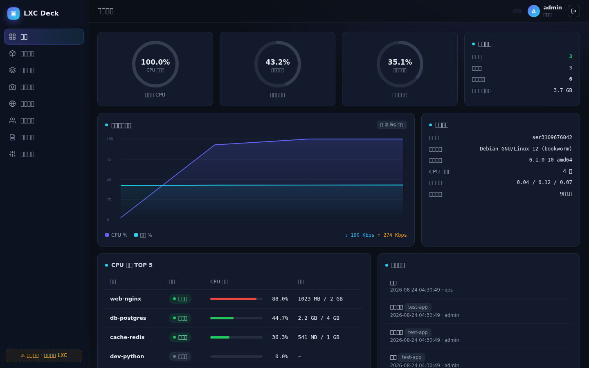

# NexPanel · 多节点管理与代理面板 / Multi-Node Management & Proxy Panel

> **中文**：参照 [NodeHatch](https://docs.nodehatch.com/zh/) 的产品思路设计的多节点 LXC 管理面板。
> 面板本身可安装在任何服务器上，通过 Agent 反向连接或 SSH 接入目标机器，远程管理其上的 LXC 容器；
> FastAPI + SQLite 后端，零构建原生 JS 前端，支持演示节点模式。
>
> **English**: A multi-node LXC management panel inspired by [NodeHatch](https://docs.nodehatch.com/).
> Install the panel on any server, connect target machines via reverse Agent or SSH, and manage LXC containers remotely.
> Built with FastAPI + SQLite and a zero-build vanilla JS frontend, with a demo node mode.



---

## 功能总览 / Feature Overview

| 模块 / Module | 能力 / Capabilities |
|---|---|
| 📊 概览 Dashboard | CPU / 内存 / 磁盘环形仪表、实时负载趋势图(120 点)、网络吞吐、TOP5 占用实例、最近动态 |
| 🖧 节点管理 Nodes | Agent 反向连接（推荐，支持 NAT）/ SSH / 演示节点三种接入；**接入时可选择是否作为母机（自动安装 LXC）**；不装 LXC 也可直接向主机下发部署节点；支持 **Debian/Ubuntu/CentOS/Rocky/Alpine**；实时指标流；凭据 Fernet 加密存储；一键生成 Agent/探针清理卸载命令 |
| 🔗 订阅中心 Subscription | 对标 X-UI-Server 的订阅链接：`/api/sub/{token}` 按 User-Agent 自动适配 **Base64 分享链接** 或 **Clash.Meta(mihomo) YAML**；8合1 全协议；管理员可随时重置令牌 |
| 🖥 双控制台 Consoles | **小鸡(容器)** 与 **母机(节点本体)** 均可打开 Web 终端；SSH 直连 PTY / Agent PTY-over-Polling(快轮询低延迟) / 演示模拟；前端 MiniTerm 渲染 ANSI，支持 `top` / `vim` / `Ctrl+C` / `Tab` / 方向键 |
| ⚡ 一键部署 Deploy | 移植 X-UI-Server：**8合1 协议矩阵**（XTLS-Reality / Hysteria2 / TUIC / Trojan / H2+Reality / gRPC+Reality / AnyTLS / Naive）与单协议下发；自动生成 Reality 密钥对 / 自签证书 / DNAT 端口映射 / 分享链接；**按机器查看已装节点，支持删除单个节点** |
| 📦 容器实例 Containers | 按节点创建 / 管理，内存 64MB 起步（64MB 步进）、启动 / 停止 / 重启 / 删除、真实 cgroup 指标回显 |
| 🗂 镜像模板 Templates | Ubuntu / Debian / Alpine / Rocky / CentOS Stream / Fedora / Arch 卡片式模板库，一键从模板创建 |
| 📸 快照备份 Snapshots | 创建 / 回滚 / 删除快照，跨实例汇总视图 |
| 🌐 网络 Network | 网桥(lxcbr)状态、子网 / 网关 / DHCP 范围、地址池用量、IP 分配明细 |
| 👥 用户管理 Users | 管理员 / 普通用户两级角色、创建 / 删除用户、自助改密 |
| 🛡 安全 Security | JWT 鉴权、PBKDF2 口令哈希、登录失败 5 次锁定 IP 10 分钟、全量审计日志 |
| 📜 审计日志 Audit | 登录、实例操作、快照、用户变更全量留痕，动作着色筛选 |
| 🐳 Docker 部署 Docker | 提供 `Dockerfile` + `docker-compose.yml` + Caddy 示例，一行 `docker compose up -d --build` 即可部署 |

---

## 快速开始 / Quick Start

### 方式一：源码运行 / Run from source

```bash
git clone https://github.com/xiaoli8571/nexpanel.git
cd lxcdeck
python3 -m venv venv && ./venv/bin/pip install -r requirements.txt
./venv/bin/python run.py          # 默认 0.0.0.0:8088
```

打开浏览器访问 `http://<ip>:8088`。

默认账号 / Default accounts:

| 用户名 Username | 密码 Password | 角色 Role |
|---|---|---|
| `admin` | `admin123` | 管理员 / Admin |
| `ops` | `ops123` | 普通用户 / User |

> 未检测到 `lxc-start` 时自动进入**演示模式**；宿主机安装 LXC 后重启面板即切换真实驱动。
> If `lxc-start` is not detected, the panel runs in **demo mode**; after installing LXC on the host, restart the panel to switch to real LXC driver.

### 方式二：systemd 部署（生产推荐）/ systemd deployment (recommended for production)

```bash
# /etc/systemd/system/lxcdeck.service
[Unit]
Description=NexPanel Panel
After=network.target

[Service]
Type=simple
WorkingDirectory=/opt/lxcdeck
EnvironmentFile=/opt/lxcdeck/.env
ExecStart=/opt/lxcdeck/venv/bin/python run.py
Restart=always
RestartSec=3

[Install]
WantedBy=multi-user.target
```

`.env` 示例 / sample:

```ini
LXCP_SECRET=change-me-to-a-long-random-string
LXCP_PUBLIC_BASE=https://panel.example.com
LXCP_PORT=8080
```

### 方式三：Docker 部署 / Docker deployment

```bash
cd lxcdeck
cp .env.example .env       # 修改 LXCP_SECRET / LXCP_PUBLIC_BASE
docker compose up -d --build
```

容器默认只发布到本机回环 `127.0.0.1:8091`，由宿主机 Caddy / Nginx 做 HTTPS 反向代理（参考 `deploy/Caddyfile.sample`）。

---

## 常用命令 / Common Commands

### 宿主机 LXC 操作 / LXC commands on host

```bash
# 查看所有容器 / list all containers
lxc-ls -f

# 查看单个容器信息 / inspect a container
lxc-info -n <container>
lxc-info -iH -n <container>          # 只取 IP

# 启动 / 停止 / 重启 / start stop restart
lxc-start -n <container>
lxc-stop -n <container>
lxc-stop -r -n <container>

# 进入容器 / enter a container
lxc-attach -n <container> -- /bin/bash
lxc-attach -n <container> -- /bin/sh

# 查看容器配置 / view config
cat /var/lib/lxc/<container>/config

# 删除容器 / destroy
lxc-destroy -f -n <container>
```

### 面板部署 / Panel deployment

```bash
# 源码运行 / run from source
python3 -m venv venv && ./venv/bin/pip install -r requirements.txt
./venv/bin/python run.py

# systemd 服务 / systemd service
systemctl start lxcdeck
systemctl restart lxcdeck
journalctl -u lxcdeck -f

# Docker
docker compose up -d --build
docker compose logs -f
```

### Agent / 探针 / Agent & Probe

```bash
# 安装 / install（面板内复制出来的命令，用 sh 更兼容）
curl -fsSL https://<panel>/api/agent/install.sh | sh -s -- --api https://<panel> --token <token>

# 卸载 / uninstall
curl -fsSL https://<panel>/api/agent/uninstall.sh | sh

# 查看 Agent 日志 / agent logs
journalctl -u lxcdeck-agent -f
```

### 订阅 / Subscription

```bash
# 通用订阅（Base64）/ universal subscription
curl -s https://<panel>/api/sub/<token>

# Clash / Mihomo YAML
curl -s "https://<panel>/api/sub/<token>?target=clash"
```

---

## 订阅中心 / Subscription Center


面板在“应用/部署”页提供 🔗 订阅按钮，对标 X-UI-Server：

- 通用订阅（v2rayNG / Shadowrocket / NekoBox 等）：`GET /api/sub/{token}`
- Clash 订阅（Clash.Meta / Mihomo / Stash / FlClash）：`GET /api/sub/{token}?target=clash`
- 自动适配：客户端 User-Agent 含 `clash` / `mihomo` / `stash` / `sing-box` / `karing` / `flclash` 时自动返回 YAML
- 管理员可在面板内一键**重置订阅令牌**，旧链接立即失效
- 所有已部署完成的节点（`apps` 表）会自动聚合进订阅，新增节点后刷新订阅即可

---

## 控制台 / Consoles

| 目标 Target | SSH 节点 | Agent 节点 | 演示节点 |
|---|---|---|---|
| 小鸡(容器) Container | `lxc-attach` 进入容器 | PTY-over-Polling 快轮询 | 模拟 Shell |
| 母机(节点本体) Host | SSH 直连 PTY | `bash -li` PTY | 模拟 Shell |

前端终端为**原始模式 MiniTerm**，支持：

- 方向键 / Home / End / PageUp / PageDown
- `Tab` 补全、`Ctrl+C` 中断、`Ctrl+L` 清屏、`Ctrl+D` 退出
- ANSI 颜色与光标移动（轻量渲染，可运行 `top` 等全屏程序）
- WebSocket 自动随弹窗关闭清理，支持窗口 resize 同步远端终端尺寸

---

## 架构设计 / Architecture

```
┌──────────────────── 浏览器 SPA (web/) ────────────────────┐
│  原生 JS 路由 · Canvas 图表 · fetch(Bearer JWT) · WS 终端   │
└──────────────▲──────────────────────▲─────────────────────┘
        REST /api/*                WS /ws/terminal/{cid}
        WS /ws/node-terminal/{nid}
┌──────────────┴──────────────────────┴─────────────────────┐
│                     FastAPI (app/)                        │
│  routes.py: auth / nodes / containers / apps / subscribe   │
│             snapshots / network / users / audit            │
├───────────────────────────────────────────────────────────┤
│                   驱动层 lxc.py (核心抽象)                  │
│    DemoRuntime(演示)  ⇄  SshOps(SSH)  ⇄  AgentOps(PTY)     │
│    接口: start/stop/restart/create/delete/live/shell       │
├───────────────────────────────────────────────────────────┤
│   SQLite data/panel.db          monitor.py (采集)          │
│   nodes/containers/snapshots    agent.py (轮询 + PTY 流)   │
│   apps/settings/templates/audit subscribe.py (订阅生成)    │
└───────────────────────────────────────────────────────────┘
```

### 关键设计 / Key decisions

- **DB 是配置事实源，Driver 是运行时执行者**：容器定义(IP/CPU/内存)入库，启停等动作委托驱动，二者解耦后可平滑替换为 LXD REST 或 libvirt-lxc。
- **Agent 反向连接**：目标机器无需公网 IP / 端口，Agent 每 3 秒轮询面板，天然穿透 NAT；面板可向 Agent 下发 `exec` 与 `pty_open/in/win/close` 命令，实现远程脚本执行和实时终端。
- **自签 HMAC Token**（JWT 兼容格式）+ PBKDF2 口令哈希，零第三方安全依赖。
- **前端无构建链**：单 HTML + CSS + JS，任何静态服务器可托管。

### 数据模型 / Data model

```
users(id, username✦, pw_hash, role, created_at)
nodes(id, name✦, kind[agent|ssh|demo], role[manage|probe],
      host, port, username, auth_type, secret, agent_token,
      public_ip, last_seen, status, os_info, lxc_ok, created_at)
containers(id, uuid✦, name✦, node_id, template, status,
           cpu, mem MB, disk GB, ip✦, note, created_at)
snapshots(id, container_id→containers, name, size_mb, created_at)
apps(id, container_id, name, app_type, params(spec+public_ip),
     links, dnat_rules, status, log, created_at)
settings(key✦, value)
templates(id, key✦, name, distro, version, size_mb, arch)
audit(id, username, action, target, detail, ip, created_at)
```

---

## API 一览 / API Reference

| 方法 & 路径 / Method & Path | 说明 / Description | 权限 / Auth |
|---|---|---|
| `GET  /api/meta` | 品牌 / 版本 / 运行模式 | 公开 Public |
| `POST /api/login` | 登录换取 Token | 公开 Public |
| `GET  /api/me` · `POST /api/me/password` | 当前用户 / 改密 | 登录 Login |
| `GET  /api/overview` | 宿主指标 + 计数 + TOP5 | 登录 Login |
| `GET/POST /api/nodes` | 节点列表 / 添加 | 列表登录，添加**管理员** |
| `POST /api/nodes/{id}/install` | 一键安装 LXC | **管理员** |
| `POST /api/nodes/{id}/rotate-token` | 轮换 Agent Token | **管理员** |
| `DELETE /api/nodes/{id}` | 删除节点（可强制删除含实例） | **管理员** |
| `GET  /api/agent/install.sh` | Agent 安装脚本 | 公开(需 token) |
| `GET  /api/agent/uninstall.sh` | Agent 一键清理脚本 | 公开 |
| `POST /api/agent/poll` · `result` · `pty_out` | Agent 心跳 / 结果 / PTY 回流 | Agent Token |
| `GET/POST /api/containers` | 列表 / 创建 | 登录 Login |
| `POST /api/containers/{id}/action` | start·stop·restart | 登录 Login |
| `DELETE /api/containers/{id}` | 删除并释放 IP | **管理员** |
| `GET  /api/templates` | 模板列表 | 登录 Login |
| `GET/POST /api/snapshots` 等 | 快照增删查 / 回滚 | 登录 Login |
| `GET  /api/apps` · `POST /api/deploy` | 部署应用 / 查询 | 登录 / 管理员 |
| `GET  /api/apps/sub-info` · `POST /api/apps/sub-reset` | 订阅信息 / 重置令牌 | 登录 / 管理员 |
| `GET  /api/sub/{token}` | 公开订阅端点（Base64 / Clash YAML） | 公开(令牌) Public |
| `GET/POST/DELETE /api/users[...]` | 用户管理 | 查看=登录 写=**管理员** |
| `GET  /api/audit?limit=` | 审计日志 | 登录 Login |
| `POST /api/admin/reset-demo` | 重置演示数据 | **管理员** |
| `WS   /ws/terminal/{cid}?token=` | 容器控制台 | 登录 Login |
| `WS   /ws/node-terminal/{nid}?token=` | 母机控制台 | 登录 Login |

统一错误格式 `{"detail": "..."}`；所有写操作自动写入审计表。

---

## 安全加固 / Security Hardening

- [x] JWT 鉴权 + PBKDF2 口令哈希
- [x] 登录失败 5 次锁定 IP 10 分钟
- [x] Agent Token 可轮换吊销；订阅令牌可重置
- [x] 探针节点（probe）拒绝控制台 / 管理操作
- [ ] 生产环境务必设置 `LXCP_SECRET` 为强随机值
- [ ] 面板建议置于 Nginx / Caddy 反代后启用 HTTPS（`/ws/` 需支持 Upgrade）
- [ ] 多面板实例可迁移到 PostgreSQL；审计表按月归档

---

## Roadmap

- [x] 多节点管理与 Agent 心跳（NAT 穿透）
- [x] Agent / 探针一键清理命令
- [x] 小鸡(容器)与母机(节点本体)双控制台
- [x] 订阅中心（Base64 / Clash YAML）
- [ ] LXD REST API 驱动（支持迁移、实时 CGroup 指标）
- [ ] WebSSH 文件管理器(SFTP)、批量操作
- [ ] 备份到 S3/OSS、定时快照策略
- [ ] 工单 / 计费 / 套餐配额（面向售卖场景）

---

## 目录结构 / Directory Structure

```
lxcdeck/
├── run.py                  # 启动入口 / entrypoint (uvicorn)
├── requirements.txt
├── Dockerfile              # Docker 镜像
├── docker-compose.yml      # Docker Compose
├── deploy/Caddyfile.sample # Caddy 反向代理示例
├── app/
│   ├── config.py           # 配置 / env
│   ├── db.py               # SQLite 封装 + 建表 + 种子数据
│   ├── security.py         # PBKDF2 + HMAC Token
│   ├── crypto.py           # Fernet 凭据加密
│   ├── lxc.py              # 驱动层: Demo / SSH / Agent 容器操作
│   ├── nodes.py            # SSH 节点操作与采集
│   ├── agent.py            # Agent 面板侧: 命令队列 / PTY 会话 / 安装卸载脚本
│   ├── monitor.py          # 多节点监控缓存
│   ├── deploy.py           # 一键下发 sing-box 协议栈
│   ├── subscribe.py        # 订阅链接 / Clash YAML 生成
│   ├── routes.py           # 全部 REST 路由
│   └── main.py             # FastAPI 组装 + WS 终端 + 静态托管
└── web/
    ├── index.html
    ├── css/style.css       # 深色主题设计系统
    └── js/app.js           # SPA: 路由 / 视图 / Canvas 图表 / MiniTerm
```

---

## License

MIT
